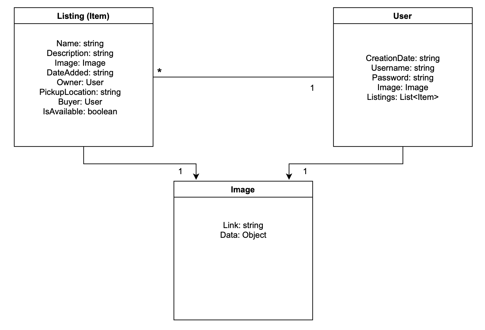

<h2>About</h2>
PolyGold is a CSC 307 (Intro to Software Engineering) project that aims to reduce waste on campus at Cal Poly by making the sharing of goods more possible and accessible to students. It's a webapp that allows users to list and claim free items and pick them up around campus. This allows students who are moving out or are no longer in need of certain items to get connected to students who could make use of them, saving the lister from a trip to the dump and creating a more sustainable Cal Poly community by promoting the reusing of certain goods.

<h2>UI Protoype</h2>
View our full UI protoype <a href="https://www.figma.com/file/dIHkl7bid9EDPGmS3LAC0j/Poly-Free-Stuff?node-id=0%3A1" target="_blank">here</a>

<sub>note: last updated 10/20/21</sub>

<h2>Environment Setup</h2>

```npm install```

```cd backend```>```npm run dev```

```cd frontend```>```npm run```

<h2>Diagrams</h2>




<h2>Code Coverage</h2>

*paste coverage report here*
